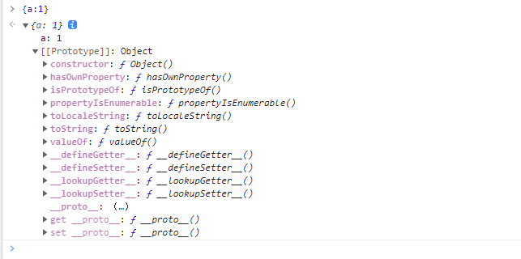
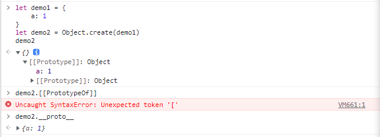
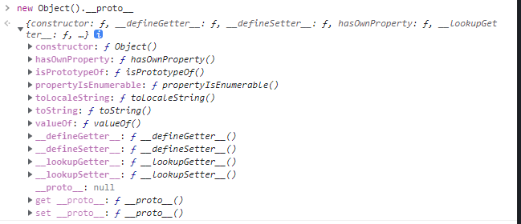

### Prototype

#### 终极原理new
当一个函数被new操作符操作会经历如下的过程：

- 在内存中创建一个新对象(空对象)

- 这个对象内部的[[prototype]]属性会被赋值为该构造函数的prototype属性

- 构造函数内部的this，会指向创建出来的新对象(实例)。(ps:因此由同一个构造函数构造的实例共享一个原型)

- 执行函数的内部代码(函数体代码)

- 如果构造函数没有返回非空对象，则返回创建出来的新对象


#### 1.原型的本质
JavaScript中的对象有一个特殊的`[[Prototype]]`内置属性，属性值是个特殊的对象，它要么为 null，要么就是对另一个对象的引用。该对象被称为“原型”。



#### 2.如何查看对象的原型
那要如何查看这个原型呢？早期的ECMA是没有规范如何去查看`[[prototype]]`。有下面两种方式

- 浏览器给我们的对象中提供了一个属性`__proto__`，可以让我们查看一下这个原型对象。
- ES5提供的`Object.getPrototypeOf(obj)`方法




#### 3.原型的作用（属性/方法的查找）
当我们从一个对象中获取一个属性的时候，它会触发[[get]]操作。1.在当前对象中去查找对应的属性，如果找到就直接用。2.如果没有找到，那么它就会沿着它的原型(链)[[prototype]]查找，直到原型为null。



#### 4.函数的原型
函数创建时，底层都是通过new Function()构造出来的，因此所有函数本质是Function的一个实例对象！由于它既是函数也是对象，因此称之为函数对象。而实例化函数对象构造出来的对象,仅仅只是对象没有函数特性，即`(new func() instanceof Function===false)`

此外还有个问题，构造函数Function是怎么来的？没错，`Function.constructor===Function`。Function是由自身构造出来的！！！
`Function.__proto__===Function.prototype`为true,打印值均为`ƒ () { [native code] }`,这也是**所有函数对象的隐式原型__proto__**。

函数都有一个显式原型（prototype属性），这个属性值就是函数的另外一种表达形式————对象。
因为函数不能直接输出内部保存的属性和方法，需要通过prototype对象来给实例传递。然而也不能直接传递，如果直接传递给实例对象，那么当实例对象变更时，原型对象也会变！

函数对象的显示原型proptotype包含的构造函数就是其本身,函数对象的构造函数都是`ƒ Function() { [native code] }`

```
let func=function(){
    this.a=1
}
let f1=new func()

//任意函数对象func的构造函数都是Function，即func.constructor===Function
//func的显式原型的构造函数是自己本身func，即func.prototype.constructor===func
//函数的显式原型对象上也没有内部的属性和方法。即func.prototype.a===undefined
// 创建空对象obj，obj.__proto__=Function.prototype,


//上面例子中，func是f1的构造函数。
//首先创建一个空对象，为了方便我们称之为newInstance
//newInstance的原型__proto__=构造函数的prototype，即func.prototype
//func内部的this，指向newInstance,即newInstance可以调用func内的一切变量和方法了。
//执行构造函数func()，如果没有返回非空对象，则返回newInstance
//最后赋值给f1
f1.__proto__ //{constructor:func,[[Prototype]]:Object}这里的Object是一个空对象
```