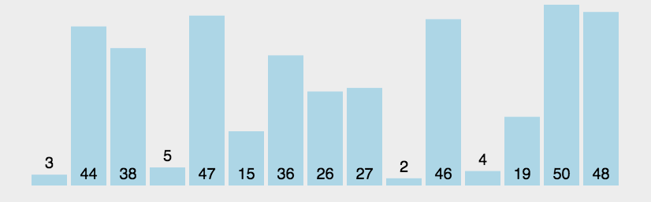
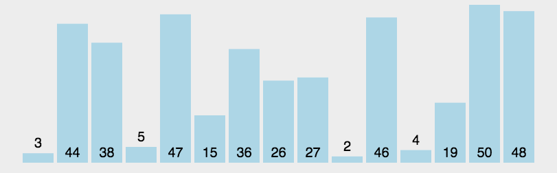

## 十大排序算法
#### 1.排序的定义
对一序列对象根据某个关键字进行排序

输入：n个数：a1,a2,a3,...,an 输出：n个数的排列:a1',a2',a3',...,an'，使得a1'<=a2'<=a3'<=...<=an'。

js提供的sort()原理:当数组长度小于等于10的时候，采用插入排序，大于10的时候，采用快排。对于长度大于1000的数组，采用的是快排与插入排序混合的方式进行排序的，因为，当数据量很小的时候，插入排序效率优于快排。

#### 2.对于评述算法优劣术语的说明
稳定：如果a原本在b前面，而a=b,排序之后a仍然在b的前面；不稳定：如果a原本在b的前面，而a=b，排序之后a可能会出现在b的后面；

内排序：所有排序操作都在内存中完成；外排序：由于数据太大，因此把数据放在磁盘中，而排序通过磁盘和内存的数据传输才能进行；

时间复杂度：一个算法执行所耗费的时间。空间复杂度：运行完一个程序所需内存的大小。

#### 3.排序算法图片总结

图片名词解释：n：数据规模 k 桶的个数 in-place：占用常数内存，不占用额外内存 Out-place：占用额外内存。

### 1.冒泡排序(Bubble Sort)
每次将一个数冒泡出来

### 2.选择排序(Selection Sort)

### 3.插入排序(Insertion Sort) 

### 4.希尔排序(Shell Sort) 

### 5.归并排序(Merge Sort)
采用分治法，将数组不断二分直到不能分再比较排序，将排序好的小数组合并归纳在一起。

### 6.快速排序(Quick Sort)
采用分治法，用中间值来将数组划分为大小两个子数组，子数组再取中间值划分，直到不可分，再将子数组(小)+中间值+子数组(大)合并。因为处理大数据时快所以叫快排

### 7.堆排序(Heap Sort)

### 8.计数排序(Counting Sort) 

### 9.桶排序(Bucket Sort)

### 10.基数排序(Radix Sort)
